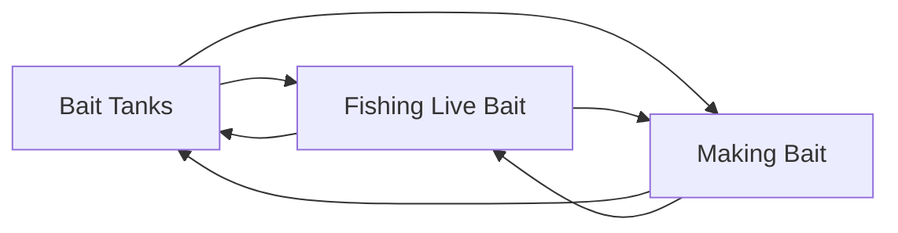

# Bait

<!-- index:start -->
## Index

- [Bait Tanks](bait-tanks.md) — The bait tank is what turns bait you bought or made into bait you can still fish hours later.
- [Fishing Live Bait](fishing-live-bait.md) — Live bait is the backbone of SoCal fishing — sardine, mackerel, and anchovy fished alive for yellowtail, white seabass, calico bass, halibut, bluefin, and yello
- [Making Bait](making-bait.md) — "Making bait" is catching your own live bait before you go fishing, as opposed to buying it.
<!-- index:end -->

<!-- mermaid:start -->
## Map

<!-- mermaid:end -->
