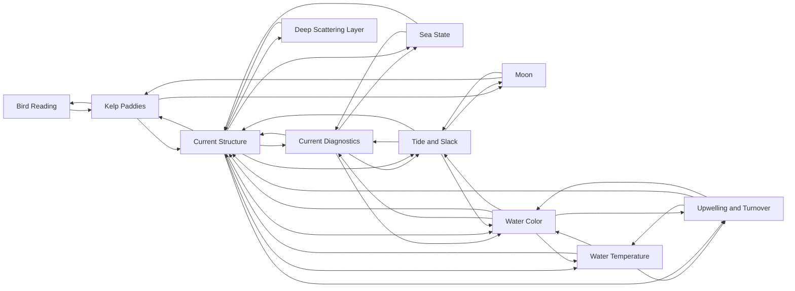

# Conditions

<!-- index:start -->
## Index

- [Bird Reading](bird-reading.md) — Birds are the fastest long-range fish detector on the water.
- [Current Diagnostics](current-diagnostics.md) — This is the observables note: how to read current strength and direction off things you can actually see on the water, so you can pick and adjust presentation i
- [Current Structure](current-structure.md) — This is the mechanism note: how moving water plus bottom structure builds a food chain, and where on a bank or island that chain concentrates.
- [Deep Scattering Layer](deep-scattering-layer.md) — The deep scattering layer (DSL) is a dense band of small organisms — hake, small rockfish, squid, myctophids, zooplankton — that sits 600+ ft down by day and ri
- [Kelp Paddies](kelp-paddies.md) — Drifting kelp paddies are floating structure — they hold bait, shade, and gamefish (yellowtail, dorado, paddy bluefin, tripletail, bycatch) out over open water.
- [Moon](moon.md) — The moon phase is a probability adjustment, never a gate.
- [Sea State](sea-state.md) — A raw wind + swell pull (height, period, direction) is not a fishability read on its own.
- [Tide and Slack](tide-and-slack.md) — Tidal phase decides when to be where.
- [Upwelling and Turnover](upwelling-and-turnover.md) — Chlorophyll is not a yes/no signal — it has an age.
- [Water Color](water-color.md) — Water color / chlorophyll is the second axis alongside SST.
- [Water Temperature](water-temperature.md) — SST is one axis of a two-axis read (temperature and water color / chlorophyll).
<!-- index:end -->

<!-- mermaid:start -->
## Map

<!-- mermaid:end -->
