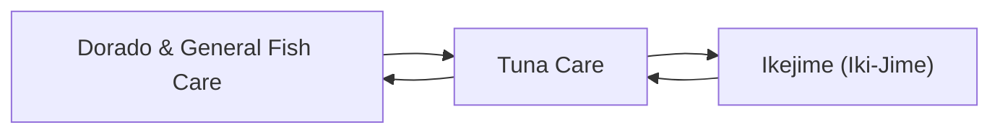

# Fish Care

<!-- index:start -->
## Index

- [Dorado & General Fish Care](dorado-and-general.md) — Dorado get cared for differently from tuna — the priority is protecting their color and flesh, not bleeding — and the second half of this note collects the icin
- [Ikejime (Iki-Jime)](ikejime.md) — Ikejime is spiking the fish's brain to kill it instantly, the top tier of tuna care when quality is the goal.
- [Tuna Care](tuna-care.md) — The tuna care chain, from the gaff shot that boats the fish to the slurry that holds its quality for the drive home.
<!-- index:end -->

<!-- mermaid:start -->
## Map

<!-- mermaid:end -->
