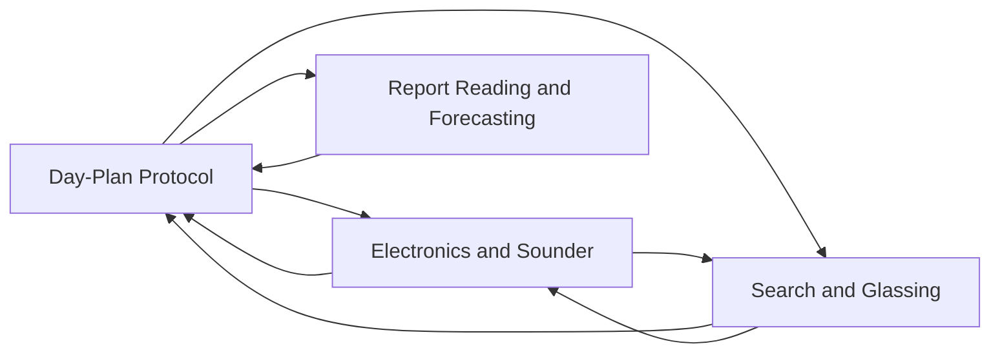

# Planning

<!-- index:start -->
## Index

- [Day-Plan Protocol](day-plan-protocol.md) — The procedure chat and the boat-day skill follow to turn conditions +
- [Electronics and Sounder](electronics-and-sounder.md) — How to use the sounder and radar to find fish and to decide whether to stop.
- [Report Reading and Forecasting](report-reading-and-forecasting.md) — How to age, discount, and project fishing reports into a plan.
- [Search and Glassing](search-and-glassing.md) — How to actually look for offshore fish, and how to anchor once you find the water.
<!-- index:end -->

<!-- mermaid:start -->
## Map

<!-- mermaid:end -->
