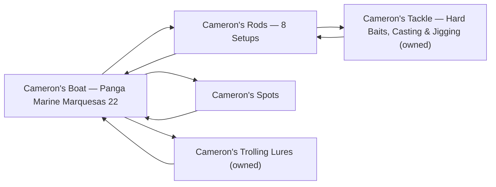

# Cameron's Profile

Cameron is the first user of this KB. These files hold **his** boat, gear, and
spots; the universal knowledge lives in the branch notes and every entry here
links out to it. The day-plan protocol resolves recommendations against this
profile (owned gear, boat envelope) and falls back to class terms for anyone
without one.

- [boat.md](boat.md) — Panga Marine Marquesas 22: operating envelope + trolling
  platform geometry.
- [rods.md](rods.md) — the 8 rod/reel setups with line classes.
- [tackle.md](tackle.md) — owned hard baits (irons, poppers, casting/jigging).
- [trolling-lures.md](trolling-lures.md) — owned trolling spread.
- [spots.md](spots.md) — home waters, modeling anchors, naming rules (full
  coordinate library in [`sources/spot-lists.md`](../../sources/spot-lists.md)).

Programs in progress: kite fishing for bluefin (started July 2026), nighttime
bluefin jigging (Aug 2026), September BOLA bottom yellowtail, and daytime
swordfish research (manual reels) — see the notes for the attributed open items.

<!-- index:start -->
## Index

- [Cameron's Boat — Panga Marine Marquesas 22](boat.md) — Operating envelope and trolling platform for Cameron's boat.
- [Cameron's Rods — 8 Setups](rods.md) — Cameron's rod/reel inventory.
- [Cameron's Spots](spots.md) — Cameron's spot library.
- [Cameron's Tackle — Hard Baits, Casting & Jigging (owned)](tackle.md) — Cameron's owned casting/jigging hard baits (inventory complete as of 7/23/26).
- [Cameron's Trolling Lures (owned)](trolling-lures.md) — Cameron's owned trolling spread (inventory complete as of 7/23/26, ~25 lures incl.
<!-- index:end -->

<!-- mermaid:start -->
## Map

<!-- mermaid:end -->
