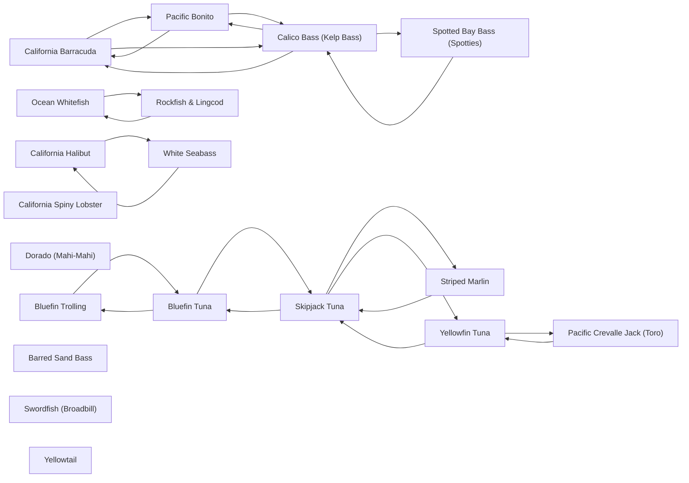

# Species

<!-- index:start -->
## Index

- [California Barracuda](barracuda.md) — A nearshore pelagic that patrols the kelp lines, boiler zones, and beach edges and shows up in the same water as the coastal bass.
- [Bluefin Trolling](bluefin-trolling.md) — The decision spin-out for bluefin tuna: which trolled or towed presentation to pull, and when, by wind, fish grade, water, and sea state.
- [Bluefin Tuna](bluefin-tuna.md) — Pacific bluefin are SoCal's premier big-game target — a multi-year-resident fishery that runs from sub-30 lb schoolies to 300 lb+ cows in the same season.
- [Pacific Bonito](bonito.md) — A schooling nearshore pelagic that runs in fast, hard-charging packs on the bait, boiling on the surface and firing up everything around it.
- [Calico Bass (Kelp Bass)](calico-bass.md) — The signature SoCal inshore ambush predator: a kelp- and reef-dweller that sits on a defined structure edge and eats what the current sweeps past it.
- [California Halibut](california-halibut.md) — A flatfish you catch by out-thinking the sand, not by covering it.
- [California Spiny Lobster](california-spiny-lobster.md) — SoCal's "bug" fishery — caught recreationally by hoop netting rocky structure and kelp edges at night during the fall–winter season.
- [Dorado (Mahi-Mahi)](dorado.md) — SoCal/Baja dorado are a warm-water, structure-oriented offshore fish: they ride the green-cold / blue-warm boundary and stack on kelp paddies and open-water sch
- [Ocean Whitefish](ocean-whitefish.md) — The ocean whitefish (*Caulolatilus princeps*) is a tilefish, not a rockfish — a distinct, highly underrated table fish that schools over hard bottom and sand ed
- [Pacific Crevalle Jack (Toro)](pacific-crevalle-jack.md) — The Pacific crevalle jack (*Caranx caninus*, "toro") is a warm-water, inshore structure gamefish — common in Baja (Sea of Cortez, BOLA, farther south) and a rar
- [Rockfish & Lingcod](rockfish-lingcod.md) — The deep-structure bottomfish complex: reds/vermilion, bocaccio ("salmon grouper"), blue (Johnny) bass, coppers and the rest of the rockfish family, plus lingco
- [Barred Sand Bass](sand-bass.md) — The sand-flat and deep-structure cousin of the calico: a bottom-associated bass that lives on and around hard bottom, wrecks, and the reef-to-sand transition an
- [Skipjack Tuna](skipjack-tuna.md) — The ubiquitous warm-water tuna of the SoCal/Baja offshore — "skippies" are almost always the first and most aggressive fish to a chum line or a burning cast, wh
- [Spotted Bay Bass (Spotties)](spotted-bay-bass.md) — The bay-and-harbor bass — a light-line, structure-relating fish you catch on eelgrass edges, mooring cans, dock pilings, riprap, and channel drops inside San Di
- [Striped Marlin](striped-marlin.md) — SoCal striped marlin are a fall sight-and-troll billfishery: slow-troll lures/skirts through clean blue water off a bait/color edge, tease fish up, and switch t
- [Swordfish (Broadbill)](swordfish.md) — SoCal daytime deep-drop swordfish: find deep contour structure where the deep scattering layer holds bait, then present a dead bait in/below the layer and let t
- [White Seabass](white-seabass.md) — The premier SoCal inshore gamefish, and one of the most pattern-driven: white seabass bites cluster on the moons, fire on the slack tide, and require a specific
- [Yellowfin Tuna](yellowfin-tuna.md) — SoCal's summer-into-fall bread-and-butter tuna — 8–10 lb up to 40–50 lb, with 15–25 lb the average grade.
- [Yellowtail](yellowtail.md) — SoCal/Baja yellowtail are a structure-and-bait fish that show three faces:
<!-- index:end -->

<!-- mermaid:start -->
## Map

<!-- mermaid:end -->
