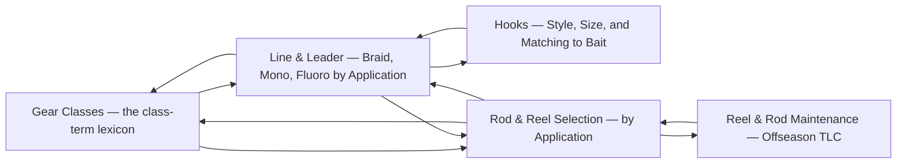

# Tackle

<!-- index:start -->
## Index

- [Gear Classes — the class-term lexicon](gear-classes.md) — The KB describes gear in class terms (jig-stick class, 40–60 lb class, 200g-knife-jig class) so a species/technique note can say "reach for the surface-iron cla
- [Hooks — Style, Size, and Matching to Bait](hooks.md) — A hook is chosen on three axes: style (how it sets), size (matched to the bait, then the fish), and wire gauge (how much it burdens a live bait vs.
- [Line & Leader — Braid, Mono, Fluoro by Application](line-and-leader.md) — Three materials, three jobs.
- [Reel & Rod Maintenance — Offseason TLC](reel-maintenance.md) — Gear is a big investment; a rinse-and-store discipline is what makes it last.
- [Rod & Reel Selection — by Application](rod-and-reel-selection.md) — The right stick is decided by the application (what you're throwing and at what grade of fish), not by brand.
<!-- index:end -->

<!-- mermaid:start -->
## Map

<!-- mermaid:end -->
