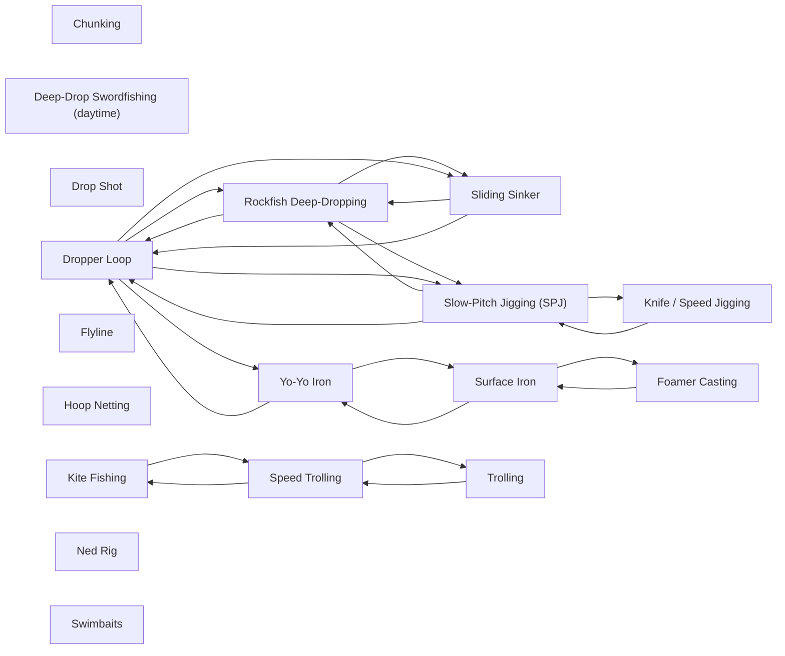

# Techniques

<!-- index:start -->
## Index

- [Chunking](chunking.md) — Execution for chunking: cutting bait into pieces to build a chum line, then drifting a hook bait back through it so it looks like just another falling chunk.
- [Deep-Drop Swordfishing (daytime)](deep-drop-swordfishing.md) — Execution for daytime broadbill: a dead bait presented in or just below the deep scattering layer on deep contour structure, on a slow drift, with a breakaway l
- [Drop Shot](drop-shot.md) — Execution for the drop shot: the hook is tied up the line and the weight hangs below on a tag end, so the bait is suspended a fixed height just above the bottom
- [Dropper Loop](dropper-loop.md) — Execution for the classic dropper-loop rig: a loop knot tied into the leader holds the hook above a sinker that rides on the bottom, so the bait wafts in the cu
- [Flyline](flyline.md) — Execution for flylining live bait: a hooked live bait fished with no weight, left to swim on its own out and away from the boat.
- [Foamer Casting](foamer-casting.md) — Run-and-gun casting to breaking tuna — pulling up on a spot of foaming fish and putting a lure into it before the school sinks out.
- [Hoop Netting](hoop-netting.md) — The method for California spiny lobster: baited rigid hoop nets dropped on rocky structure at night, soaked, then pulled and reset to cover ground.
- [Kite Fishing](kite-fishing.md) — Execution for flying a rigged flying fish on the surface under a kite — the standard SoCal method for the big bluefin grade (100 to 300 lb fish).
- [Knife / Speed Jigging](knife-jigging.md) — baitfish — a reaction bite, distinct from the fall-triggered slow-pitch presentation.
- [Ned Rig](ned-rig.md) — Execution for the Ned rig in the bays: a small soft stickbait on a mushroom-head jig, hopped subtly along the bottom, with the bite read in the line before you
- [Rockfish Deep-Dropping](rockfish-deep-dropping.md) — Put a bait or jig on hard bottom in deep water, hold the zone against the drift, and keep off the snag.
- [Sliding Sinker](sliding-sinker.md) — Execution for the sliding-sinker (Carolina) rig: the weight rides free on the main line above a swivel, and a leader runs from the swivel to the hook, so a fish
- [Slow-Pitch Jigging (SPJ)](slow-pitch-jigging.md) — Work an asymmetric metal jig so it flutters on the fall like a wounded, dying baitfish — the fall is the trigger, not the retrieve.
- [Speed Trolling](speed-trolling.md) — Execution for pulling a fast-tracking hard bait to locate bluefin and pull a bite over water you can't otherwise cover.
- [Surface Iron](surface-iron.md) — Long-cast a heavy chrome/painted iron on a jig-stick and swim it back near the surface with a steady grind, varying speed to trigger the bite.
- [Swimbaits](swimbaits.md) — Execution for soft-plastic swimbaits and slugs on kelp and reef bass.
- [Trolling](trolling.md) — General offshore trolling execution — how to run a spread, where each lure lives in it, and how to pair a rod to a lure.
- [Yo-Yo Iron](yo-yo-iron.md) — Drop a heavy iron straight down to a mark and crank it back up at full speed on a heavy jig-stick — a vertical presentation for fish holding deep or in current
<!-- index:end -->

<!-- mermaid:start -->
## Map

<!-- mermaid:end -->
